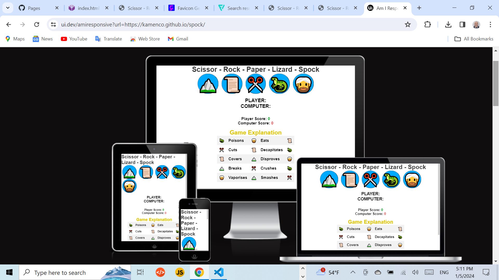

# Rock - Paper - Scissor - Lizard - Spock 

https://kamenco.github.io/spock/ 

This website is deployed on the github.io

This is project with Rock, Paper, Scissor, Lizard and Spock,
developped for entertainment. 

It also has a Music section with Home Made Music.
The music and singing is performed by the developer of this site.

Both, the Paper - Scissor - Rock - Lizard - Spock game and
the music block are made in HTML, CSS and JavaScript.

The idea for the game was accepted from you tube and I have improved the code by adding two more items Spock and Lizard. The flow control was improved as to the terniary condition was added the OR operator.

The idea for the music block was taken from the book "Java Script
for Sound Artists" by William Tutner.

Image for the game.

Image for the table explaning the game rules.

Image for the music block.

There were no bug found during the development. The codes were tested on https://validator.w3.org/ for html and and css on https://jshint.com/.

Frameworks and libraries have not been used.

Hover css was used in the game section onclicking the icon, and also onclicking the buttons in the music block.

Google font were used Roboto. Git was used in the terminal to commit to Git.

No images were used from other sources, the music is made by the developer.

This side is used with the help of codeacademy's course Essential JavaScript and the help of the tutors and facilitators, and mentors. Thanks to facilitator Laura for sending me useful links for React.

