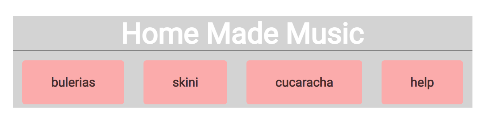
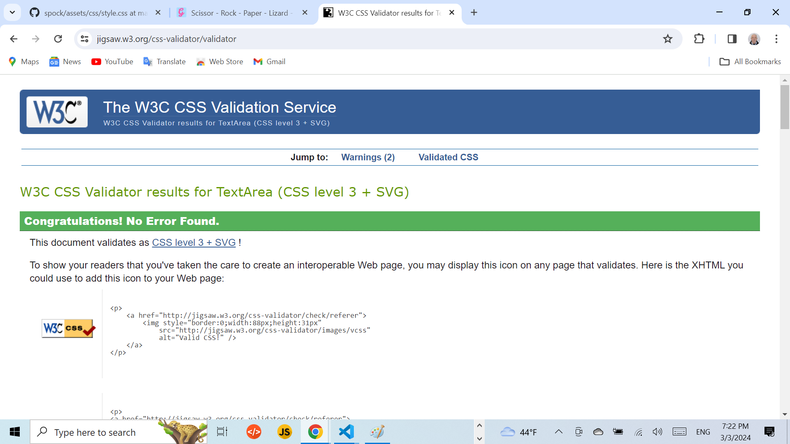
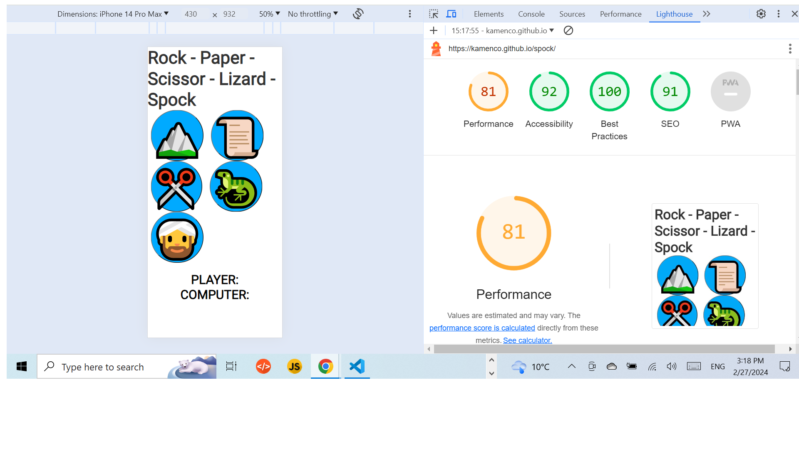

# Rock - Paper - Scissor - Lizard - Spock
## Welcome to my Rock - Paper - Scissor - Lizard - Spock game!

This is a player versus computer game where, following the rules of the game, the user and computer can score points 
with the option the player to reset the result to 0.

This game is for someone who wants to play a game that is not difficult and does not require significant mental comittment to win, as it is basically a game of chance. The game is simple enough that it can be played and enjoyed by anyone including young children and even people with mental difficulties like people with Down's syndrome, the approprate music has to be chosen for this purpose.

The goal of this game is to test my JavaScript abilities and of course to make a fully functional game with good design and contrasting colors. It also has a Music section with Home Made Music, giving option for music entertainment simultaniously while playing the game.

Please visit my game here:
https://kamenco.github.io/spock/ 

## Performance of the web page on different devices

## Table of Content 
1. [Wireframe](#wireframe)
2. [UX Description](#ux-description)
3. [Technologies used](#technologies-used)
4. [Website Features](#website-features)
5. [Features to implement](#other-features)
6. [Testing and Validation](#testing-and-validation)
7. [Bugs and Issues](#bugs-and-issues)
8. [404 page](#notfound-page)
9. [Deployment](#deployment)
10. [Credits](#credits)

---

## [Wireframe](#wireframe)

At the beginning of the game the rough design was created with pen on a paper with a thought in mind to be displayed across different platforms.

There is no difference from the wireframe to the final product as the disign is quite simple. 

Image of the main page:

---

## [UX Description](#ux-description)

For this game, bright and bold colours have been chosen. The design keeps the player's focus and doesn't distract him/her from the game!

I have chosen similar graphics encircled in a blue background that changes to lightblue when hovered.

The resset button is kept simple and contrasting, the buttons for choosing the music are in pink on grey background, making them also visible enough. The game rules are set in a table without much textual explanation, in bright colors and graphics, making the rules easy to understand, and thus not requireing too much reading. 

The layout is kept pretty simple, right after the images the gamer scrolls down for a look and reference of the game explanation and is ready to start the game. As an additional entertainment he/her can choose some music.

At the very bottom of the page is a  reset button, that has an onclick event listener and resets all the scores playerScore to 0 and computerScore to 0, result and player Computer to blank starting the game over again from the beginning. 

Image for the table explaning the game rules.
The table explanation briefly depicts the rules of the game of Rock, Paper, Scissors, Lizard and Spock and clarifies how the scoring works. The image help's to cement the rules in the player's mind. When they feel they understand the rules of the game, they will start playing more confidently.

Image for the music block.

---

## [Technologies used](#technologies-used)

- HTML5. Used to structure my website. There is only one page of this website as this is a simplified version of this game. Only one semantic element has been used <main> to improve the SEO optimization. Responsive design was implemented by the code in the head with metatag defining the control of page's dimensions and scaling.
- CSS3. Used to style my website.  Responsive web design is used to resize, and shrink, the content to make it look good on any screen.  Box sizing border box was used to  padding and border of element's total width and height. Media query with breakpoint of 420px was used for the responsiveness of the page. Hover css was used in the game section onclicking the icon, and also onclicking the buttons in the music block.
- JavaScript. Used to provide functionality to my website. Frameworks and libraries have not been used. JavaScriptfunction playGame() uses Math function for random choice from constant choices. After that the function checks if the game is a tie, and after that with else and switch statements checks case by case playerChoice with the computerChoice. Increments playerScore and computerChoice by 1. Using classList on resultDisplay changes the color of YOU WIN! to green and YOU LOOSE! to red. The reset() function resets the playerScoreDisplay and computerScoreDisplay to 0 using innerHTML. Resets resultDisplay to blank also by innerHTML and playerDisplay and computerDisplay using textContent to reset the strings.
- Github - The cloud based service for hosting repositories for over 73 million developers
- Git - Used to add, commit and push my changes to the server.
- Favicon.io - Used to source my favicon icons for my website.
- Google Fonts - Used to source different fonts in my css file. Google font were used Roboto.
- CoralDraw was used to illustrate this page with the flow chart's logic.
- This page was made with Visual Studio Code. Visual Studio Code was used from codeanywhere.com. Also the Git Hub repository has been cloned to the desktop of my computer by logging to the Git Hub repository, click on clone and download, paste the HTTP addres in the terminal. Then open the folder spock on my desktop with Visual Studio Code and start working adding, comitting and pushing the changes that have been made. In code terms I type git clone and then paste the url copied from the Git repository then the cloning begins by pressing enter. Then in the terminal I changed the current folder with
     cd "C:\Users\kamen\OneDrive\Desktop". The spock folder appears on my desktop and in there using Visual Studio Code start working on the project and saving it by
     git add . git commit and git push.
 
Flow chart to work out the logic path the program needs to take.

---
## [Website Features](#website-features)

This is a simplified game Scissor, Rock, Paper, Lizard, Spock player against computer. Player chooses manually the picture by clicking on it and the computer chooses randomely.  The chosen characters are displayed in words. Then the win and loose is displayed in green and red respetfully, and player's score computer's score are displayed and incremented by one respetfully. 

As far as the homemade music block is concerned the player can choose to listen songs while playing.

---

## [Features to implement](#other-features)

Given more time to invest in the project, I would like to implement some more features: 

- A count-up counter. On reaching a certain number, for example 10, one round will be won. The round counter will be added to count the won and lost rounds. Then all variables will be reset to 0 or blank.
  
- Some basic animation to the pictures can be added to add some nice visual effects to the project. Perhaps the picture can enlarge slightly for the winning player and decrease in size slightly for the losing computer and vice-versa. Or perhaps by adding some wings that will flap cheerefully when win and fall down sadly when lose.
- This project can target young children and children and people with Down's syndrom provided I change the melodies with such appropriate for children. A lot more melodies should be used and the streaming of music should go until the player decides to stop. The melodies should be chosen randomly or in order of their appearence.

 ---
 
 ## [Testing and Validation](#testing-and-validation)

 The HTML and CSS coding was tested on https://validator.w3.org

 HTML checking.

CSS checking.

The page is tested on different browsers Chrome, Firefox, Safari, Opera. The page is responsive and contains all the functions accross differenr screens and sizes.

The javascript files have been checked on www.jshint.com. There are no issues. Probably have to improve the identation so that the code to look better.

The accessibility testing.
For testing accesibility and performance, I used Lighthouse in Dev tools. 
Lighthouse runs an audit of your website and feeds back a set of scores for accessibility, performance and best practices among others. 

I can confirm that the website passed with great scores. See report below:

---
## [Bugs and Issues](#bugs-and-issues)

There is an issue with Iphone 13 and iPhone13. The music block is not fully visible. Probably vh for the .btn has to be declared at vh50 which will scale the buttons to 50%. This issue has not been resolved. There is another issue, there is scriool bar on the small portable devices. This is due to the table layout. If there is no table the issue is resolved.

However the programe performs very well on all the rest devices such as iPhone14, pixel7,Samsung Galaxy S8+, Samung Glaxy S20 Ultra.

---

## [404.html](#notfound-page)

404.html page was created and shows that the browser connects to the server but can not find the page.
 - This happens rarely but sometimes the server malfunctions.
 - This happens when the URL is not valid anymore and the file is missing.
 - The page opening is triggerd by the file ".htaccess" located in the root directory. This files serves the purpose of passing on instructions to the server to open the page with code line ErrorDocument 404 /404.html

 - ---

## [Deployment](#deployment)

+ The site was deployed to GitHub pages. The steps to deploy are as follows.
  - In the Git Hub repositorynavigate to the settings tab.
  - From the source section dropdown menu select Master Branch.
  - Once the master branch has been selected, the page provides the link to the live site.

---

## [Credits](#credits)
The music and singing is performed by the developer of this site. The favicons were taken from https://favicon.io/. and namely from the favicon generator. The icons for the project were taken from https://www.klipartz.com/. Before starting the project I was looking for something that will give me the idea of how to implement JavaScript in the best possible way. I ended up not complicating the code as I wanted to stay to the basics of what I have covered so far.
 - The video I used as reference was from Bro code you tube channel. https://youtu.be/n1_vHArDBRA
 - I have added two more characters lizard and spock and changed the Java Script code respetively using the or sign to check for additional charachter. I have also added the reset button and also the 404.html page whith alink to bring back the user to the main page.

The idea for the game was accepted from you tube and I have improved the code by adding two more items Spock and Lizard. The flow control was improved as to the terniary condition was added the OR operator.

The idea for the music block was taken from the book "Java Script
for Sound Artists" by William Tutner.

This side is used with the help of Codeacademy's course Essential JavaScript and the help of the tutors and facilitators, and mentors. Thanks to facilitator Laura for sending me useful links for React, thanks to Mr. Medale and Marco for the technical support.

[Back to top](#wireframe)
