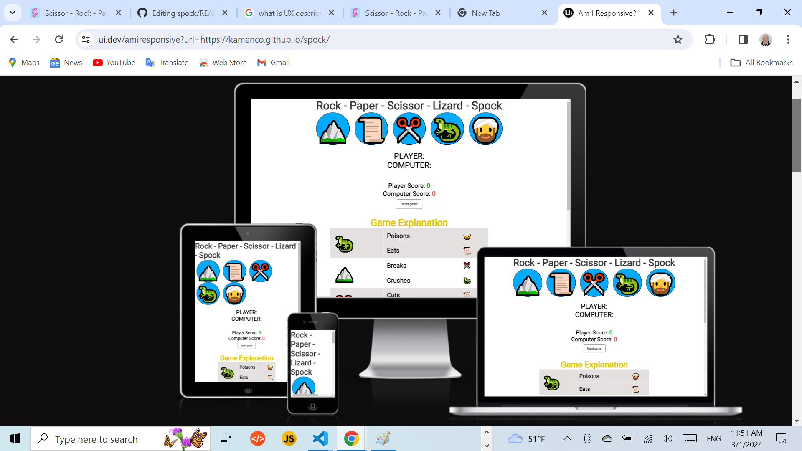

# Rock - Paper - Scissor - Lizard - Spock
## Welcome to my Rock - Paper - Scissor - Lizard - Spock game!

This is a player versus computer game where, following the rules of the game, the user and computer can score points 
with the option the player to reset the result to 0.

This game is for someone who wants to play a game that is not difficult and does not require significant mental comittment to win, as it is basically a game of chance. The game is simple enough that it can be played and enjoyed by anyone including young children and even people with mental difficulties like people with Down's syndrome.

The goal of this game is to test my JavaScript abilities and of course to make a fully functional game with good design and contrasting colors. It also has a Music section with Home Made Music, giving option option for music entertainment simultaniously while playing the game.

Please visit my game here:
https://kamenco.github.io/spock/ 

## Performance of the web page on different devices

## Table of Contents
1. [Wireframe](#wireframe)
2. [UX Description](#ux-description)
3. [Technologies used](#technologies-used)
4. [Website Features](#website-features)
5. [Features to implement](#other-features-to-implement)
6. [Testing and Validation](#testing-and-validation)
7. [Bugs and Issues](#bugs-and-issues)
8. [Peer Reviews](#peer-reviews)
9. [Deployment](#deployment)
10. [Credits](#credits)
11. [Final Thoughts](#final-thoughts-for-pp2)

---

## Wireframe

At the beginning of the game the rough design was created with pen on a paper with a thought in mind to be displayed across different platforms..

### Game page

There is no difference from the wireframe to the final product as the disign is quite simple. 

Image of the main page:

---

## UX Description (User Experience)

For this game, bright and bold colours have been chosen. The design keeps the player's focus and doesn't distract him/her from the game!

I have chosen the similar graphics encircled in a blue background that changes to lightblue when hovered.

The resset button is kept simple and contrasting, the buttons for choosing the music are in pink on grey background, making them also visible enough. The game rules are set in a table without much textual explanation, in bright colors and graphics, making the rules easy to understand, and thus not requireing too much reading. 

The layout is kept pretty simple, right after the images the gamer scrolls down for a look and reference of the game explanation and is ready to start the game. As an additional entertainment he/her can choose some music.

Image for the table explaning the game rules.

Image for the music block.

---

## Technologies used

- HTML5 - Used to structure my website. There is only one page of this website as this is a simplified version of this game. Only one semantic element has been used <main> to improve the SEO optimization. Responsive design was implemented by the code in the head with metatag defining the control of page's dimensions and scaling.
- CSS3 -Used to style my website.  Responsive web design is used to resize, and shrink, the content to make it look good on any screen.  Box sizing border box was used to  padding and border of element's total width and height. Media query with breakpoint of 420px was used for the responsiveness of the page.
- JS - Used to provide functionality to my website.
- Github - The cloud based service for hosting repositories for over 73 million developers
- Git - Used to add, commit and push my changes to the server.
- Favicon.io - Used to source my favicon icons for my website.
- Google Fonts - Used to source different fonts in my css file.

### Start-Page

There is only one page for this website, as it is a simplified version of the game.
Ht
An essential task for this website was to have to responsive displays that change upon clicking a button/div when the player is ready to play. 

By hiding the main page through surrounding it in a div in my html file, I was able to make this start page show by default and then hide that page when the player clicks 'start'. 

The Start-Page briefly describes the rules of the game of Rock, Paper, Scissors and tells the user how the scoring system works. An image provides visual feedback to the user as well to help cement the rules in their mind. When they feel they understand the rules of the game, then can enter a name/username and click 'start'. If they feel they need to go back to the start page to check over the rules or change their username, they can do so by clicking the title on the game page.

The music and singing is performed by the developer of this site.

Both, the Paper - Scissor - Rock - Lizard - Spock game and
the music block are made in HTML, CSS and JavaScript.

The idea for the game was accepted from you tube and I have improved the code by adding two more items Spock and Lizard. The flow control was improved as to the terniary condition was added the OR operator.

The idea for the music block was taken from the book "Java Script
for Sound Artists" by William Tutner.

There were no bug found during the development. The codes were tested on https://validator.w3.org/ for html and and css on https://jshint.com/.

Frameworks and libraries have not been used.

Hover css was used in the game section onclicking the icon, and also onclicking the buttons in the music block.

Google font were used Roboto. Git was used in the terminal to commit to Git.

No images were used from other sources, the music is made by the developer.

This side is used with the help of codeacademy's course Essential JavaScript and the help of the tutors and facilitators, and mentors. Thanks to facilitator Laura for sending me useful links for React.
